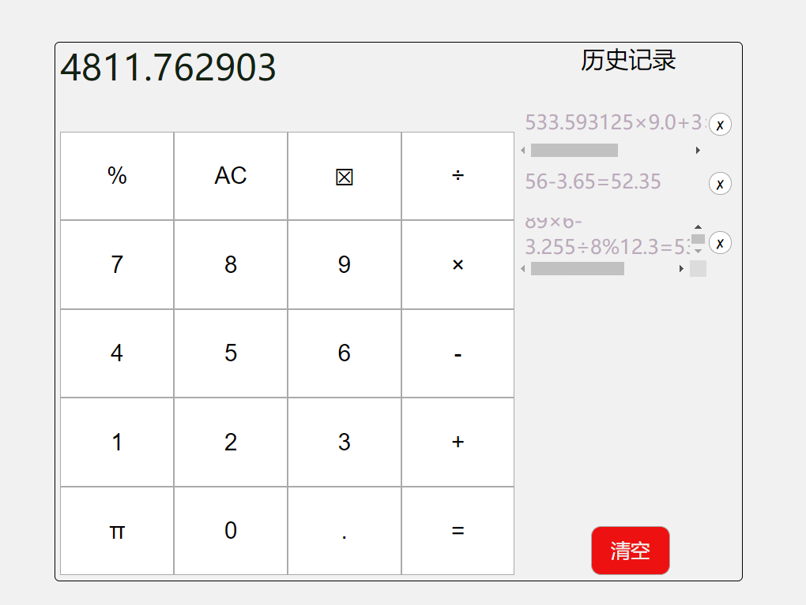

# 标准数学计数器

## 预览效果

## 功能
可以实现加减乘除,求余数和计算小数等基本运算，<br>
结果可以精确到小数点后面的六位，<br>
每次计算完成之后会自动加入历史记录，<br>
可以对历史记录进行逐条或者全部的删除
## 技术栈

前端html+css+javascript(jquery)<br>
css布局方式:栅格布局

## 使用方法
直接下载源代码或者利用git的clone功能<br>
```git clone https://github.com/freak2000/calculator.git```
